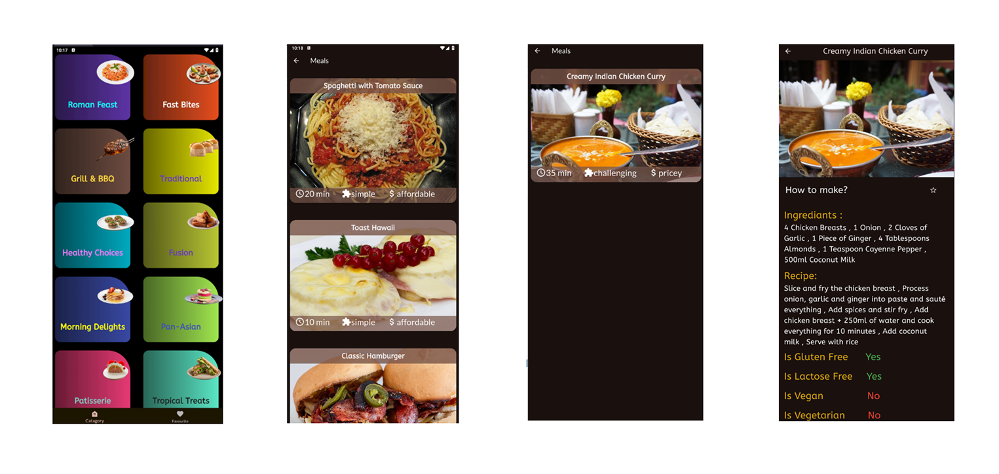
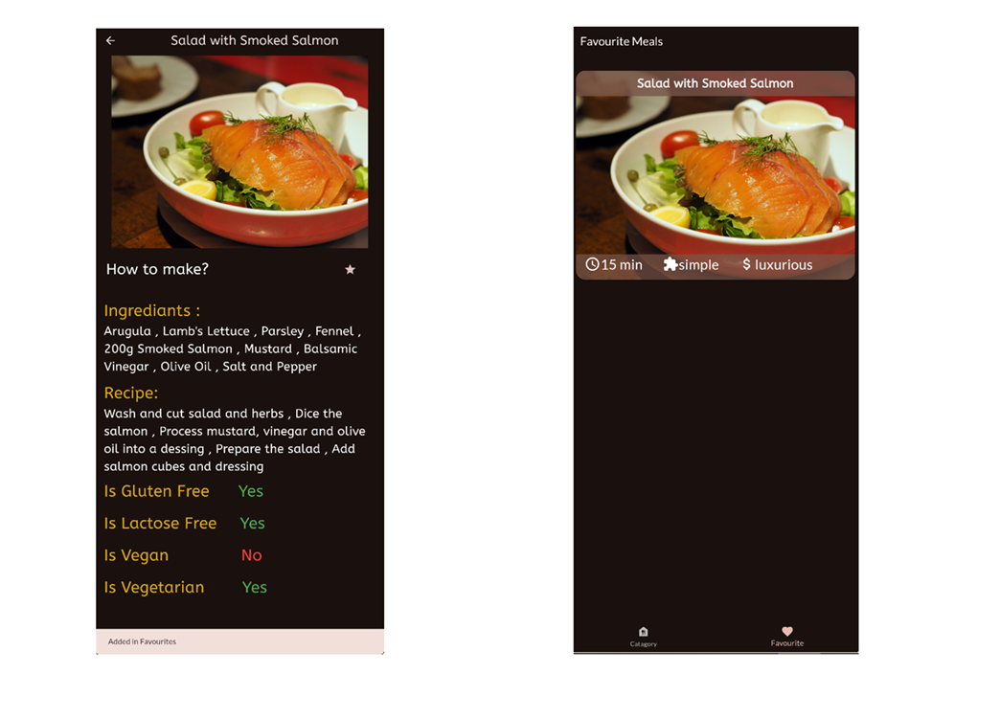

# 🍴 BiteBook  

BiteBook is a Flutter-based mobile application designed for browsing and managing meals/recipes.  
Users can explore categories of meals, view detailed recipes, and save their favorites for quick access.  

---

## 🚀 Features
- Browse meals by **categories**
- View **meal details** including time, complexity, and affordability
- See complete **ingredients & recipe instructions**
- Mark meals as **Favorites**
- Simple & clean **UI with images**

---

## 📱 Screenshots  

### 🟢 Categories Screen  
Browse all meal categories in a visually appealing grid.  
  

### 🟠 Meals List Screen  
View meals of the selected category with time, difficulty, and price tags.  
  

### 🔵 Meal Detail Screen  
Get full details including ingredients, cooking steps, and dietary labels (Gluten-Free, Vegan, etc).  
  

### ❤️ Favourite Meals Screen  
Quickly access the meals you have marked as favorites.  
  

---

## 🛠️ Tech Stack
- **Flutter** (Frontend UI)  
- **Dart** (Programming Language)  
- **GetX** (State Management & Navigation)  

---

